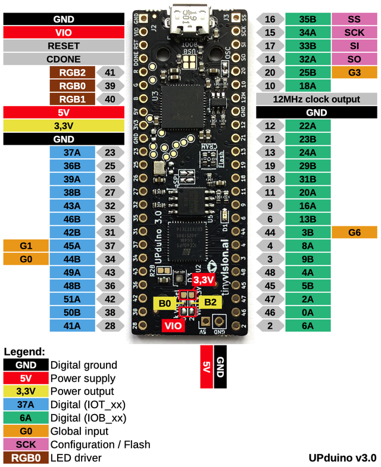

Specifications
================

The UPduino supports the following features:
- Lattice iCE40 UP5K UG48 FPGA

UPduino Pinout
--------------
The pinout was kindly provided by u/Tabsels on r/FPGA (Reddit)

