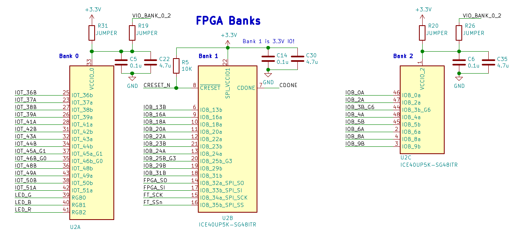
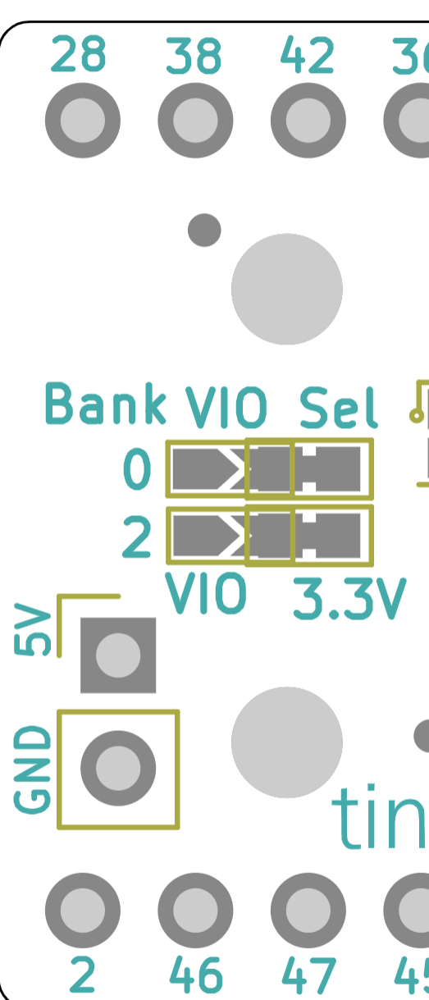
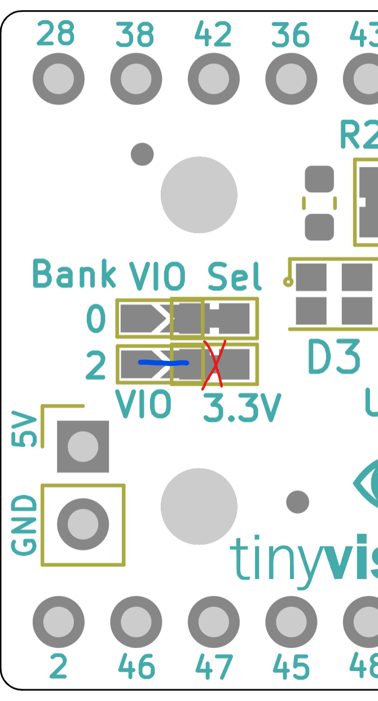

How to connect the two banks in the FPGA to a voltage other than 3.3V?
====
The FPGA on the UPduino v3 has 3 banks hooked up as follows:

Bank 1 is connected to the 3.3V supply and cannot be modified since it is hooked up the the Flash and the FTDI parts, both of which are 3.3V devices.

Bank 0 and Bank 2 however, can be changed to source/sink voltages at any arbitrary voltage within the Lattice FPGA IO specification by the following scheme in this part of the board:

Bank 0:
----
Cut the trace for R31 (shorted on the board) and solder across R19.

.. image:: upduino_banks_selection_0.png
  :width: 100
  :alt: UPduino FPGA bank connections

Bank 2:
----
Cut the trace for R20 (shorted on the board) and solder across R26.

