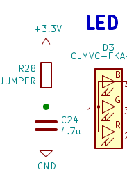
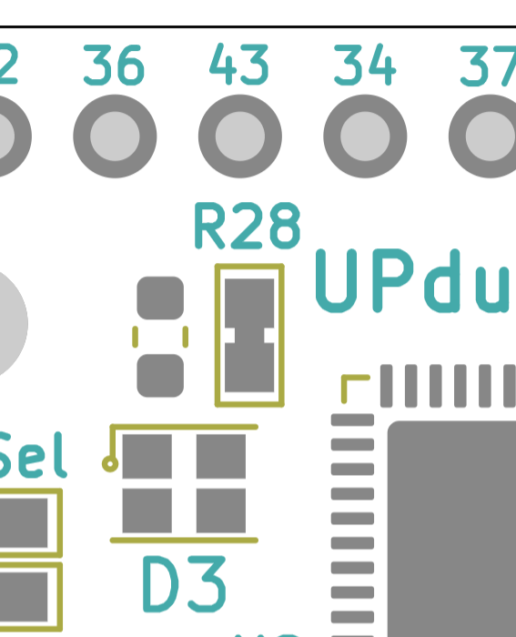

How to disconnect the 3 color LED so you can use the pins for your own PWM experiments?
====

The 3 color LED can be disconnected from power to allow the use of the 3 pins from the FPGA for user purposes such as driving an external PWM sink, utilizing the programmable current sources for say a current signalling scheme or simply GPIO.

The following schematic shows the LED drive circuit where R28 can be disconnected to completely disable the LED. Note that R28 is a short on the board and so will need to be cut.

The corresponding board section is shown below. Cut the shorting trace on R28 to disable the 3 color LED.
 
