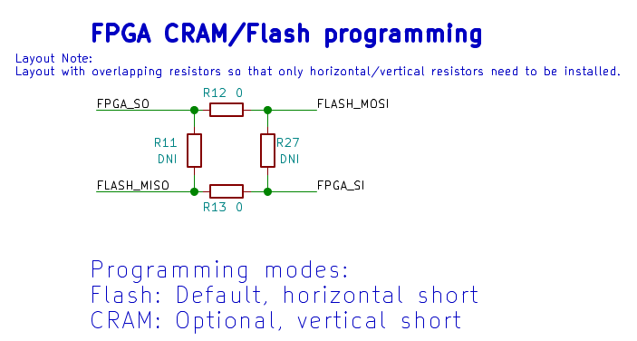
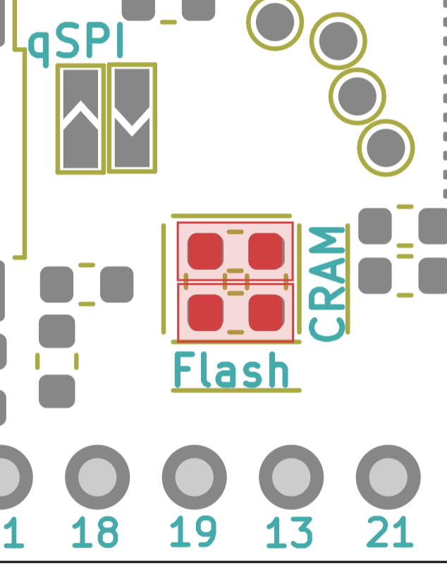
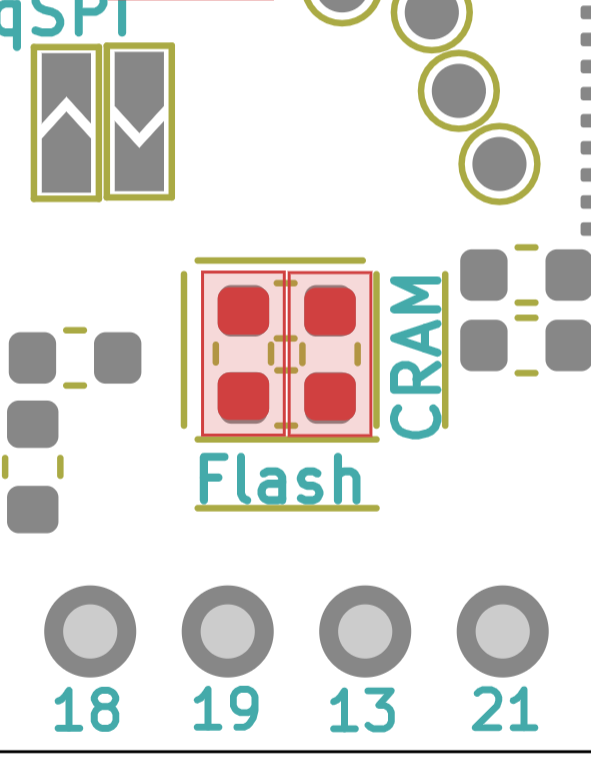

How to program the FPGA CRAM?
====

The FPGA on the UPduino can be programmed by either programming the flash and letting the FPGA reconfigure itself after a reset (default) or by programing the FPGA under direct control of the FTDI part (CRAM programming).

The CRAM in the FPGA is volatile and so will not survive a power down. However, the programming is extremely fast (65ms) as compared to programming the Flash followed by a reset (>30 seconds). In applications where the FPGA may need to be reconfigured quickly and often such as under control of a processor, it makes sense to use the CRAM mode.

CRAM Programming Mode
----
As shown below, the default option is for R12 and R13 to be installed while leaving out R11/R27. To program the CRAM, the user must remove R12/R13 and install R11/R27.

The default (flash) board layout is shown below:

Removing R12/R13 and installing R11/R27 would look like the following layout:

