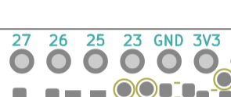

How to connect a PMOD device to the UPduino?
====

The UPduino pinout is setup specifically so that connecting to a 3.3V PMOD device is very easy. The pins in the following region of the UPduino are laid out per the PMOD specification allow you to interface directly to any single PMOD peripheral.

