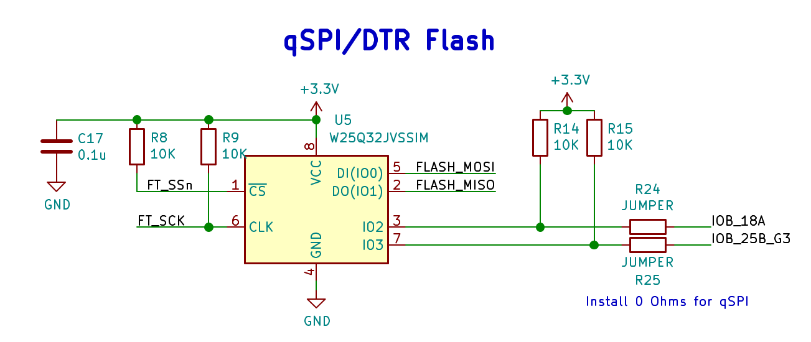
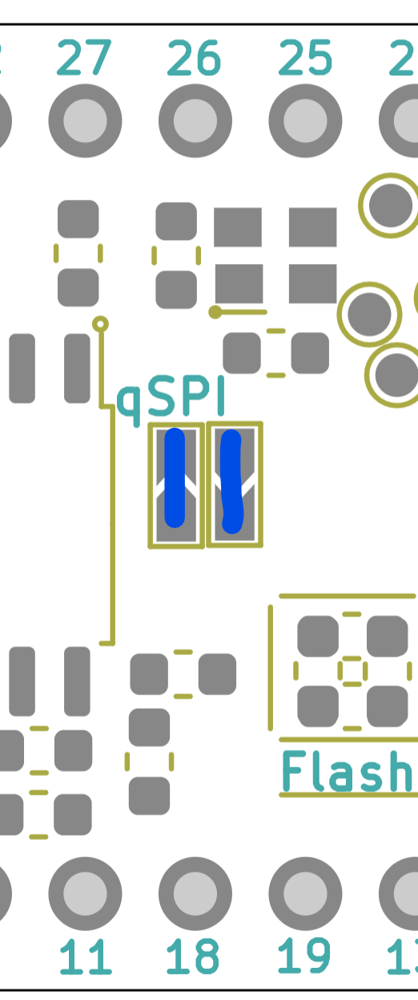

How to enable qSPI flash for _much_ higher flash throughput (up to 8x!)
====

The UPduino flash is a qSPI/DTR capable device. ie. it is capable of operating with four IO's instead of a single IO and also using both edges of the clock, effectively giving 8x the bandwidth on the SPI bus. In an actual use case, this bandwidth increase will only happen for burst read/writes.

The layout makes special  arrangements to allow for this mode of operation of the flash by shorting R24/R25 in the schematic below:

The corresponding portion of the layout is labelled qSPI for clarity and should be shorted as shown.

